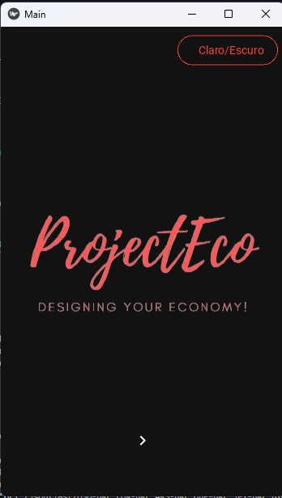
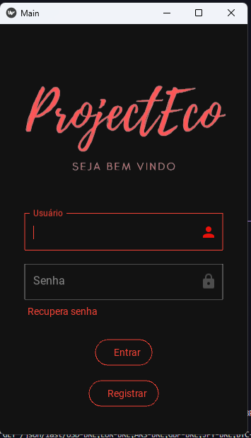
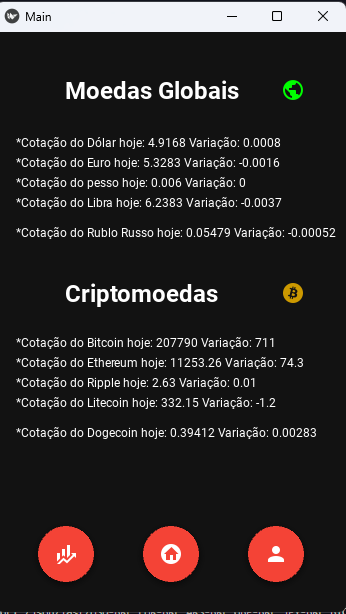
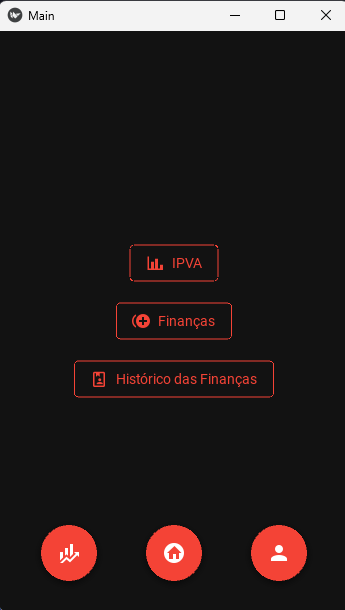

# Projeto_Economia+

Este é um projeto pessoal criado com o objetivo de aprimorar minhas habilidades em Python e o framework kivy, kivymd e usamos sql lite para cria o banco de dados. 
O Economia+ é um aplicativo para desktop e mobile destinado a auxiliar o usuário no gerenciamento de suas finanças. Esta primeira versão permite aos usuários registrar 
seus gastos, calcular o IPVA e oferece a promessade novas funcionalidades  
a serem adicionadas posteriormente.

  
  

## Funcionalidades

- Regitra finanças.
- Detalhes da cotação das moedas globais e criptomoedas.
- simulado do valor a ser pago no IPVA.

## Funcionalidades Futuras (Planejadas)

- [Calculo imposto de renda]
- [Buscar informaçaõ da B3]

## Tecnologias Utilizadas

- python
- sql

## Contribuições
Contribuições são bem-vindas! Se você deseja contribuir para este projeto, sinta-se<be> à vontade para abrir uma issue para discutir suas ideias ou enviar uma pull request com
melhorias.

